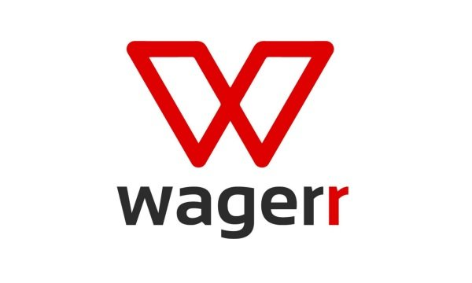
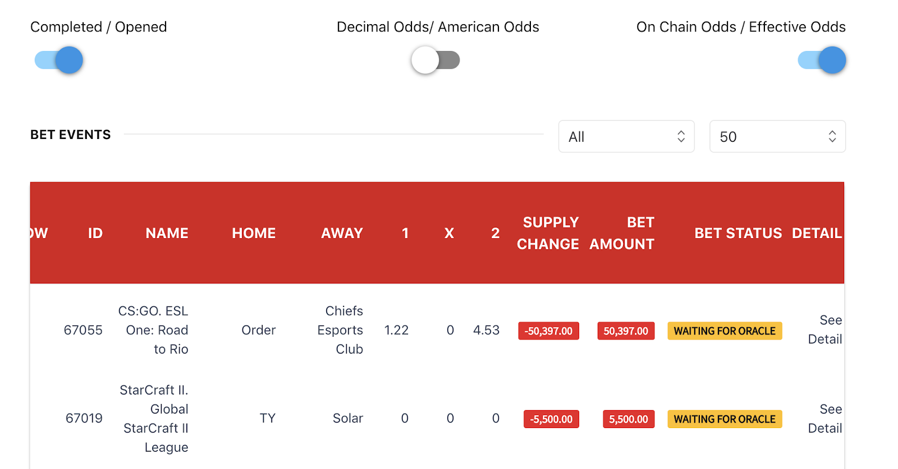

# About Us

## What is Wagerr?

[Wagerr](https://wagerr.com) is a decentralized sportsbook where users can bet on sports anonymously from anywhere in the world with the best odds. As a blockchain based sportsbook Wagerr offers bettors distinct features and benefits unavailable anywhere else. Wagerr has been operational since 2017 and continues to set the standard in the industry with unmatched transparency, true odds, low fees, complete privacy, and reliability.

## Why should I use Wagerr?

Wagerr offers several distinct features that our players find appealing over other sportsbooks or betting exchanges.

* **Global Access**:
Wagerr is a Peer-to-Peer network, where the software runs on your own device. Therefore, it can be accessed from anywhere in the world at any time without restrictions, as long as you have an internet connection of course.

* **Anonymous Betting**:
Wagerr does not require you to sign up to its service or hand over any personal/identifying information. Simply download the Wagerr software to access the betting platform.

* **No Betting Limits**:
Bettors on the Wagerr platform are capable of betting as much as they wish. There is no need to find a counterparty either, the Wagerr blockchain will accept any size bet you make. (Learn more)

* **No Third Party Risks**:
The Wagerr Blockchain rids the need for trusted 3rd parties.
    * Bettors remain in complete control of their money at all times, meaning no more dodgy bookmakers running away with your funds. 
    * The Wagerr blockchain acts as the counterparty to all bets which means that you always get paid.
    * Winners are welcome at Wagerr and you will never be restricted or suspended.  Wagerr is incapable of  such actions because all users remain anonymous.

* **Sharp odds**:
The Wagerr blockchain is not a company and does not require profit. This means Wagerr can provide you with the best odds in the world. In fact the Wagerr network goes one step further and allows users to share in the success of the platform via a revolutionary concept called “Value coupling”

## How do I get started with Wagerr?

To get started with Wagerr you need to first download the Wagerr software, the links below will get you started depending on the device you wish to use. 

* Android - [androidapp.wagerr.com](androidapp.wagerr.com)
* iOS - [iosapp.wagerr.com](iosapp.wagerr.com)
* Desktop - [wagerr.com](wagerr.com)

To begin betting you will need to purchase WGR coins. Read how to purchase coins here.

If you have any difficulties with downloading the software please join the Wagerr [Telegram](https://t.me/wagerrcoin) or [Discord](https://discord.com/invite/vecf8Ca) community to ask for help.

## Can I bet with Bitcoin or other currencies?

No. Wagerr is purpose built for sports betting. The unique features that we offer players (no limit betting, value coupling, no third party risks etc.) are only possible because we have built our own blockchain with it’s own incentive mechanisms.

If we were to solely use BTC, ETH or various stable coins, then this would be no different to many of the sportsbooks that you likely see and use today. Wagerr is a new business model that requires WGR for the model to work. We envision in the future that businesses will utilise the Wagerr protocol to operate their sportsbook more efficiently and provide users an option to gamble with their preferred currency, be that USD, BTC or something else.

Therefore, if you wish to use the Wagerr betting platform directly you will need to obtain WGR first. Read more about how to purchase WGR here.

## How can I purchase Wagerr?
WGR can be purchased using your debit or credit card via [instaswap.io](https://instaswap.io). Instaswap also provides a crypto currency to WGR swap service for those that do not wish to register with one of our Cryptocurrency exchanges to purchase WGR directly.

We keep an up to date list of exchanges that support WGR on our website [here](https://wagerr.com/en/get-wallet). 

## Why do you say Wagerr is transparent?
Unlike normal sportsbooks, Wagerr is open source and all data regarding betting is publicly available. This is unprecedented, and we think it's very exciting!

When you make a bet with Wagerr, it is recorded on the Wagerr blockchain (think database). This database can be viewed [here](https://explorer.wagerr.com/#/betevents).

You are able to see on each event how much was bet and when resulted, how much WGR was added or removed from the total supply. You can even click into the details of each event and see when individual bets were made, the odds they were made at, how many bets on either team and much much more. All of this information allows you to make better informed decisions, as well as understand how the system works.

## How does the Wagerr’s “Value Coupling” work?

Wagerr has engineered a token economy centred around the WGR coin. The WGR coin acts as an incentive mechanism that aligns the incentives of the bettors and the sportsbook. All bettors must use the WGR coin to make bets, this is the primary use case of the coin. The first question many ask is why introduce a coin in the first place?

If we were solely to use BTC, ETH or various stable coins, then this would be no different to many of the sportsbooks that you likely see and use today. Wagerr is a new business model that requires WGR for the model to work. The unique features that we offer players like no limit betting, no third party risks or earning some of the house edge are only possible because we have built our own blockchain and token economy. Without the blockchain or WGR coin this would not be possible.

The token model (business model) is designed simply that the value of the WGR coin aligns to the value of the Wagerr betting network. It is best described through an example:

Let’s assume that there are 1000 WGR coins in circulation. If I wanted to make a 100 WGR bet, I would use the app/wallet to place a bet against the blockchain. As the bet is placed the 100 WGR is immediately burned (removed from the total supply), leaving only 900 WGR coins remaining.

**Losing bet** - If the bet loses then the coin supply remains at 900 WGR I.e. WGR has now become more scarce.
**Winning bet** - If the bet was to win the WGR supply would increase by an amount dependent on the odds, let’s say to 1,100 WGR.

Bettors will win and lose overtime and therefore the supply of WGR will fluctuate overtime. However, overtime we expect that more WGR will be removed from the supply then added because a small house edge is added to the odds which is then burned (removed from the supply). Wagerr charges an incredibly low 3% margin that is competitive with the best traditional sportsbooks in the world and we expect this to lower overtime. The below picture should help visualise this house edge.

If you haven’t realised, effectively what Wagerr does is burn WGR coins to return the value of the house edge back to holders of the WGR coin. Afterall, the Wagerr blockchain is not a company and does not need to earn profits. Winning bettors should compound their winning by holding over a longer term to benefit from this house edge. 

You should also be able to see that as the volume of betting increases (i.e. demand increases) more WGR coins are burned (reducing supply), thus putting upward price pressure on the coin. This is what we call “value coupling”, where the coin value is coupled to the value of the Wagerr betting network.

To incentivise users further to adopt WGR. Users can stake 25,000 WGR in an ‘Oracle Masternode’, whose role is to supply sporting results to the platform as well as keep the network decentralised and secure. For their efforts they earn a % of the betting fee described in the image above. 

## What is a Masternode?

A masternode is a computer that operates and helps operate the Wagerr betting network. Masternodes are rewarded by the network by earning WGR. To operate a Masternode It requires 25,000 WGR to be staked (locked up) and 24/7 computing power that goes towards keeping the network running and secure. Currently, with ~3000 masternodes online a Masternode would receive 2.85 WGR every 40 hours or so.

An Oracle masternode is similar but has the extra role of supplying sports data to the network to help Wagerr determine winning and losing bets. This involves higher costs and therefore is incentivised by earning a percentage of the betting fees that the network earns. Currently, Oracle masternodes are being operated by the team as they develop them. Once ready, this will be handed over to the public. 

Wagerr has relationships with various third parties that provide the technical services to easily manage and operate a masternode at low costs. The Wagerr [Telegram](https://t.me/wagerrcoin) or [Discord](https://discord.com/invite/vecf8Ca) community is typically the best option to ask and learn more about these services.